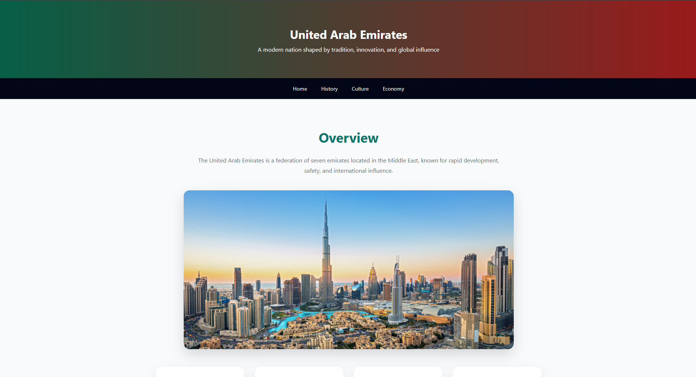

# Discover the United Arab Emirates 🌍🇦🇪

An interactive educational website about the United Arab Emirates, created for **World Day**. This project showcases the UAE’s **history, culture, economy, and modern achievements** through high-quality images, timelines, and engaging content.

---
## 📷 Screenshot



---

## 📂 Project Structure


---

## 🌟 Features

- **Responsive design**: Works on desktop, tablet, and mobile  
- **Shared CSS**: Consistent look and feel across all pages  
- **Interactive elements**: Hover animations on cards, timelines  
- **High-quality images**: For visual engagement  
- **3D spinning UAE flag** (optional) for added interactivity

---

## 🖼 Pages Overview

- **Home (`index.html`)**: Modern UAE skyline, culture, and innovation highlights  
- **History (`history.html`)**: Timeline from ancient settlements to 1971 union  
- **Culture (`culture.html`)**: Traditions, festivals, modern lifestyle, diversity  
- **Economy (`economy.html`)**: Oil, trade, tourism, finance, and future economy  

---

## 🔗 Live Demo

Check out the live website on GitHub Pages:

https://spect-ux.github.io/UAE-presentation/

---

## 📌 How to Use / View

1. Clone the repository:

```bash
git clone https://github.com/Spect-ux/uae-presentation.git
